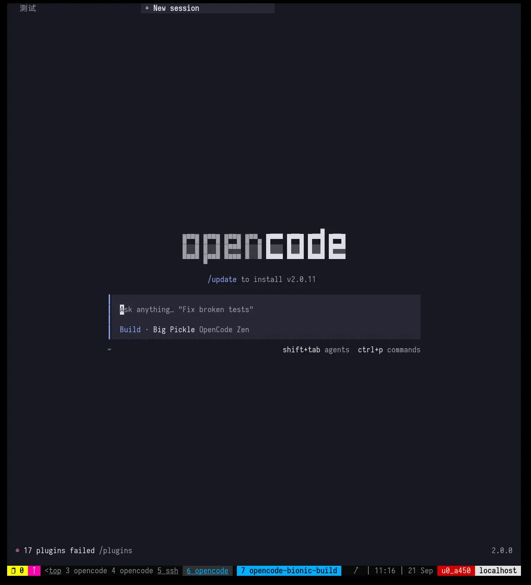

[English](./README.md) | [简体中文](./README.zh.md)

# opencode-termux

OpenCode on Termux. AI 编程助手，原生 bionic 运行时，零 glibc 依赖。



## 快速安装

```bash
curl -fsSL https://opencode.ai/install.sh | bash
```

安装完成后，通过包管理器升级：

```bash
# Termux（默认）
pkg upgrade opencode

# pacman（如已初始化）
pacman -Syu opencode
```

## 简介

[OpenCode](https://opencode.ai) 是一个 AI 驱动的终端编程助手。本项目将其打包为 [Termux](https://termux.dev) 原生 bionic 二进制，零 glibc 依赖。

三种运行时变体：

| 包名 | 运行时 | 体积 | TUI | 说明 |
|------|--------|------|-----|------|
| `opencode` | 原生 bionic | ~66 MB (UPX) | 完整 | 主线，推荐 |
| `opencode-compressed` | 原生 bionic (UPX) | ~66 MB | 完整 | `opencode` 别名 |
| `opencode-wrapper` | Bun-termux-loader | ~193 MB | 完整 | Glibc 包装，旧版 |

**主线** = 原生 bionic（`opencode`）。零 glibc，Android API >= 28，完整 TUI（bionic libopentui.so）。

## 通过 pacman 安装（可选）

Termux 默认使用 `apt`。如需 `pacman`：

```bash
curl -fsSL https://opencode.ai/install-pacman.sh | bash
```

然后安装：

```bash
pacman -S opencode
```

## 升级

```bash
# apt（默认）
pkg upgrade opencode

# pacman
pacman -Syu opencode
```

## 系统要求

- Android API >= 28（Android 9.0+）
- Termux（F-Droid 或 GitHub Release）
- 约 200 MB 可用存储

## 包格式

### 稳定版

发布在 [GitHub Releases](https://github.com/Hope2333/opencode-termux/releases)，使用滚动 tag：

- `Push260912` -- v1.18.30 / v1.18.31（v1 最终版）
- `Push260921` -- v2.0.0 GA（当前主线）

### 包类型

- **deb**: `opencode_<ver>_aarch64.deb`（Termux apt）
- **pacman**: `opencode-<ver>-1-aarch64.pkg.tar.xz`（Termux pacman）
- **native UPX**: `opencode-native-<ver>-upx.xz`（仅二进制，~66 MB）

## 从源码构建

需要 `make`、`python3`、`clang`，可选 `upx`。

```bash
# 构建原生 bionic 二进制
make build-native VER=2.0.0

# 构建压缩版（UPX）
make build-native-upx VER=2.0.0

# 构建 deb 包
make deb-native VER=2.0.0

# 构建 pacman 包
make pacman-native VER=2.0.0
```

完整构建参考见 [docs/make-maintainer.md](./docs/make-maintainer.md)。

## v1 到 v2 迁移

v2.0.0 是当前主线。v1.18.x 包保留用于回滚。

如已安装 v1：

```bash
# v2 自动替换 v1（control 中 Conflicts/Replaces）
pkg upgrade opencode
```

包名从 `opencode-glibc`（v1）改为 `opencode-wrapper`（v2 wrapper 变体）。

## 技术文档

- [docs/transplant.md](./docs/transplant.md) -- 运行时移植管线
- [docs/comparison-runtime-lines.md](./docs/comparison-runtime-lines.md) -- 运行时方案对比
- [docs/dual-track-install.md](./docs/dual-track-install.md) -- 双轨安装指南
- [docs/make-maintainer.md](./docs/make-maintainer.md) -- Makefile 参考

## 许可

OpenCode 是开源项目。本打包项目遵循相同许可。
